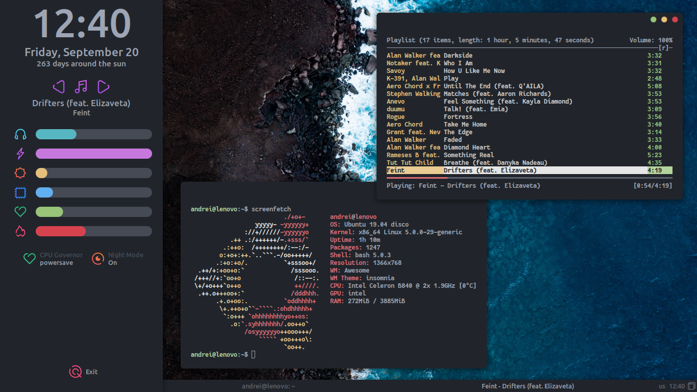

#### Details:
- OS: Ubuntu 19.04
- WM: Awesomewm

#### Dependencies:
- acpid - subscribe acpi events
- pulseaudio - control volume
- rxvt-unicode - terminal
- redshift - night light
- compton (chjj) - window compositor
- cpufrequtils - cpu governor switcher
- mpd, mpc, ncmpcpp - music player daemon and ncmpcpp client
- scrot - screenshot tool

#### Fonts:
- [Fantasque Sans Mono](https://github.com/belluzj/fantasque-sans)
- [Typicons](https://github.com/stephenhutchings/typicons.font)
- Fredoka One and Pacifico from Google Fonts
- Icomoon by [elenapan](https://github.com/elenapan/dotfiles)

To make this setup work you should create a file called `user.lua` in awesomewm config folder. This file may contain some private information and must be ignored by version control tool. Here is the file example:
```
user = {
    lock_screen_password = "change me"
}
```

#### Hotkeys:
- `super + a` - toggle sidebar
- `super + e` - show exit screen
- `super + alt + l` - show lock screen
- `PrintScreen` - take screenshot

#### Notes:
Average system load daemon contains hardcoded variable that specifies the number of CPUs. Edit `evil/sysload.lua` to make system load bar show correct information.

The script `copy-dotfiles.sh` is used for copy dotfiles into git working directory. To make this setup work on your system you should copy config files manually.

Wallpaper [here](https://unsplash.com/photos/lbIgR6AwLfw).
